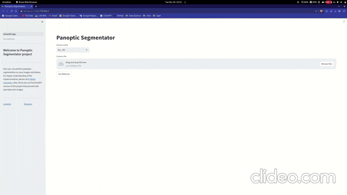

# Panoptic Segmentator

<div id="header" align="center">
  
</div>

## Introduction

<div id="header" align="center">
  
</div>

Welcome to PanopticSegmentator, a cutting-edge web application that empowers users to perform panoptic segmentation on images, videos, and even live webcam feeds. Panoptic segmentation goes beyond traditional semantic segmentation by not only classifying objects in an image but also distinguishing between stuff (e.g., background) and things (e.g., objects).

## Installation and Usage

To run the web application, you have two options:

### Option 1: Local Installation with Conda

1. Install necessary dependencies:
    ```bash
    apt-get install ffmpeg libsm6 libxext6 ninja-build libglib2.0-0 libsm6 libxrender-dev libxext6 libgl1-mesa-glx
    ```

2. Clone the repository:
    ```bash
    git clone https://github.com/kafkaGen/panoptic-segmentator
    ```

3. Create and activate a Conda environment:
    ```bash
    conda env create -n <env_name> --file requirements.yaml
    conda activate <env_name>
    ```

4. Install Python requirements:
    ```bash
    pip install -r requirements.txt
    pip install -U openmim
    ```

5. Install additional packages:
    ```bash
    mim install mmengine "mmcv>=2.0.0" mmdet git+https://github.com/cocodataset/panopticapi.git
    ```

6. Download required models:
    ```bash
    python setup.py --download-models
    ```

7. Run the application using Streamlit:
    ```bash
    streamlit run streamlit_app.py --server.port 80
    ```

### Option 2: Docker Installation

1. Build the Docker image locally:
    ```bash
    docker build -t panoptic-segmentator:latest .
    ```

    Or pull the Docker image from Docker Hub:
    ```bash
    docker pull olko123123123/panoptic-segmentator:latest && docker tag olko123123123/panoptic-segmentator:latest panoptic-segmentator:latest
    ```

2. Run the Docker container using the provided script:
    ```bash
    bash container-run.sh
    ```

    > **NOTE:** `container-run.sh` automatically determines whether your machine supports NVIDIA GPU and runs the Docker container accordingly on CPU or GPU.

### Access the Application Online

Alternatively, you can try the application online [here](http://54.82.25.5/). Please note that this is an AWS EC2 free-tier instance, so be patient with its performance.

## REST API for batch inference

### todo
- model optimization (ONNX, pruning, ...)
- add fastapi, service and client script
- add pytest (test job to ci/cd, pre-commit)